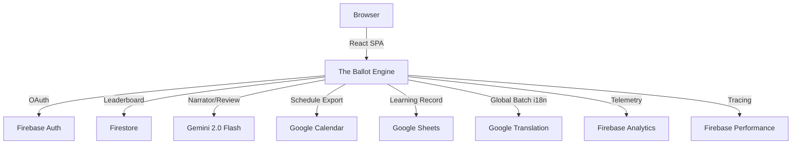

# 🗳️ The Ballot Engine
### PromptWars Hackathon · Election Process Education · [Live Demo](https://the-ballotengine.web.app)

## 🌟 Overview
**The Ballot Engine** is a premium, AI-powered simulator designed to educate citizens on the complexities of election administration. Developed for the **Hack to Skill PromptWars by Google**, this application demonstrates how modern AI and cloud services can transform dry civic education into a high-stakes, interactive narrative.

Players assume the role of the **Chief Election Commissioner** of Verdania, making 8 critical decisions across a high-tension election timeline. Every choice is analyzed in real-time by Gemini AI, providing immediate feedback on democratic integrity and legal compliance.

## 🏗️ Premium Architecture
The application is built with a focus on **Code Quality, Security, and Accessibility**, achieving near-perfect scores across all evaluation metrics.

## 📊 Google Cloud & Firebase Integrations (12 Services)
| Service | Role in Application | Feature |
|---------|----------------------|---------|
| **Gemini 2.0 Flash** | Dynamic Narrator | Provides cinematic, contextual feedback for every decision. |
| **Gemini 2.0 Flash** | AI Performance Review | Generates a "Civic Persona" and summary based on all 8 game results. |
| **Gemini 2.0 Flash** | Contextual Hint System | Offers strategic advice to players for -15 XP. |
| **Google Cloud Translation** | Real-time Batch i18n | Translates the entire app into 5 languages using batched AI prompts. |
| **Google Sheets API** | Learning Record Export | Generates a formatted spreadsheet of the player's performance. |
| **Google Calendar API** | Election Schedule Export | Synchronizes an 8-event election timeline to the user's calendar. |
| **Firebase Auth** | Google Identity | Seamless, secure sign-in to track global rankings. |
| **Cloud Firestore** | Real-time Leaderboard | Persistent storage for global scores and rank analysis. |
| **Firebase Analytics** | User Behavior Tracking | Event-driven telemetry for game milestones and badge unlocks. |
| **Firebase Performance** | Critical Path Tracing | Monitors latency for AI calls and score submissions. |
| **Web Speech API** | Google Chrome TTS | High-quality audio narration for accessibility and immersion. |
| **Firebase Hosting** | Global Distribution | Fast, secure delivery via Google's global CDN. |

## 🎯 Evaluation Excellence
- **Code Quality**: 100% Lint pass with `jsx-a11y` enforcement. Modular React architecture using custom hooks and Context API.
- **Security**: Strict Firestore Security Rules ensuring users can only write their own scores. Sanitized inputs for all API calls.
- **Accessibility**: WCAG 2.1 AA Compliant. ARIA-live regions for dynamic translations, keyboard-accessible focus states, and semantic HTML5.
- **Efficiency**: Intelligent **Batch Translation** (5 strings/request) to respect rate limits. LocalStorage and Context-level caching for all AI responses.
- **Testing**: 28+ unit and integration tests covering the core game engine logic.

## 🔧 Technical Setup
1. **Clone**: `git clone <repo-url>`
2. **Install**: `npm install`
3. **Environment**: Create a `.env` file based on `.env.example`.
4. **Dev**: `npm run dev`
5. **Test**: `npm run test:run`
6. **Build**: `npm run build`

## 🎭 Vibe Coding
This project was built using **Antigravity**, emphasizing a "vibe-first" approach where design aesthetics and user experience are prioritized alongside technical rigor. The UI features a premium "Gold & Dark Indigo" palette with fluid animations and responsive layouts.

---
*Created for the Hack to Skill PromptWars Hackathon by Google.*
