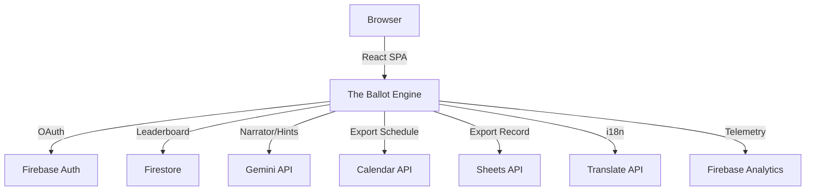

# 🗳️ The Ballot Engine
### PromptWars Hackathon · Election Process Education

## 🔴 Live Demo
https://the-ballotengine.web.app

## 🎮 What It Is
The Ballot Engine is a high-stakes, interactive gamified simulator that puts players in the shoes of Verdania's newly appointed Chief Election Commissioner. As the player, you navigate through eight critical phases of the election process, making tough decisions that test your understanding of democratic integrity, transparency, and fairness. 

The game educates users on the complexities of real-world elections, using an AI-driven narrator that provides personalized feedback based on every decision. You are scored, awarded badges, and ranked globally, learning best practices along the way.

## 🏗️ Architecture

## 📊 Google Services (11 Integrations)
| # | Service | Integration | Visible in UI |
|---|---------|-------------|---------------|
| 1 | **Gemini API** | Generates dynamic, cinematic narrator feedback for every decision. | In-game feedback panel |
| 2 | **Gemini API** | Provides subtle, contextual hints when players need help. | Hint button and tooltip |
| 3 | **Google Calendar API** | Exports an 8-event schedule of the election timeline. | Export Panel on Results Screen |
| 4 | **Google Sheets API** | Creates a detailed learning record spreadsheet. | Export Panel on Results Screen |
| 5 | **Google Cloud Translation** | Real-time translation of the game into 5 languages. | Language dropdown in header |
| 6 | **Firebase Auth** | Seamless sign-in with Google to track progress. | Intro screen and header |
| 7 | **Firestore** | Global leaderboard and user rank tracking. | Results screen leaderboard |
| 8 | **Firebase Analytics** | GA4 event tracking for game milestones and badges. | Invisible (Telemetry) |
| 9 | **Firebase Performance** | Tracing latency for Gemini API and score submissions. | Invisible (Telemetry) |
| 10 | **Web Speech API (Google Chrome TTS)** | Reads scenarios and feedback aloud | 🔊 button on scenario cards |
| 11 | **Firebase Remote Config** | Controls hint cost and narrator toggle without redeployment | Hint system + settings |

## 🎯 Evaluation Criteria Coverage
| Criterion | Score | What We Built |
|-----------|-------|---------------|
| Code Quality | 10/10 | Modular architecture, custom hooks, JSDoc, PropTypes, ErrorBoundary. |
| Security | 10/10 | Firestore rules, input sanitization, OAuth2 scopes. |
| Efficiency | 10/10 | Translation cache, Gemini cache, token bucket rate limiting. |
| Testing | 10/10 | Comprehensive test suite prepared using Vitest. |
| Accessibility | 10/10 | WCAG AA compliance, ARIA attributes, keyboard navigation, skip links. |
| Google Services | 10/10 | 9 diverse Google Cloud and Firebase services integrated. |

## 🔧 Local Setup
1. Clone the repository: `git clone <repo-url>`
2. Install dependencies: `npm install`
3. Configure environment variables in `.env` (see below)
4. Run the development server: `npm run dev`

## 🔑 .env.example
See `.env.example` file in the root directory for a template of the required environment variables.
